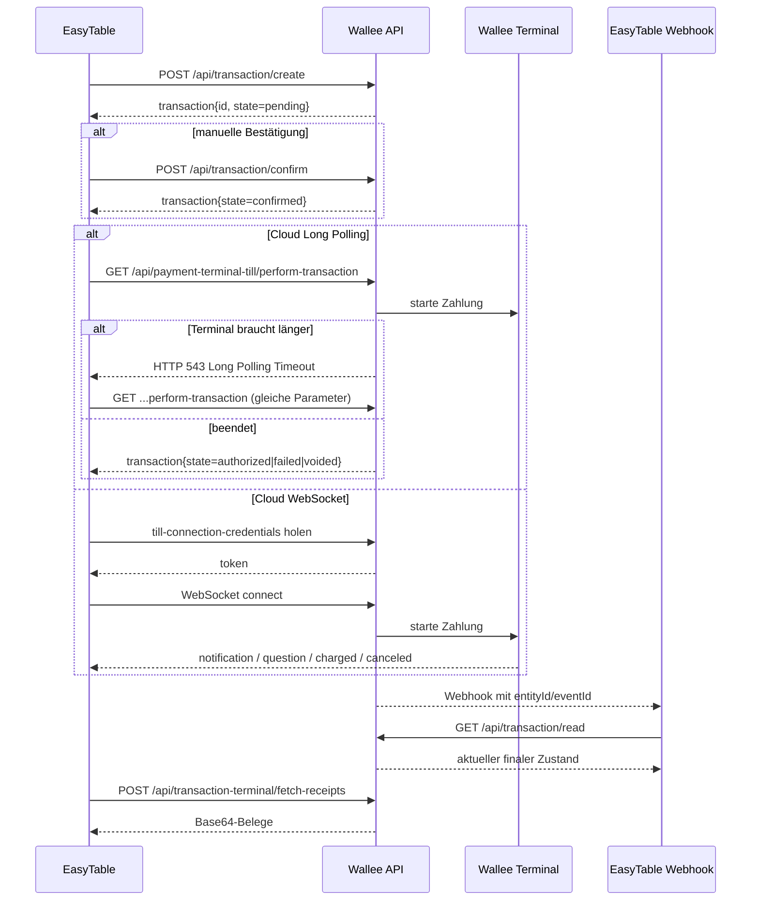

# Wallee-Analyse für eine EasyTable-Integration mit Local Till und Cloud Till

## Zusammenfassung

Für eine EasyTable-Integration mit wallee gibt es technisch drei relevante Wege, die in den offiziellen Unterlagen klar voneinander getrennt sind: Local Till Interface über lokales TCP/XML im selben LAN, Cloud Till Interface über die wallee-Cloud via Long Polling oder WebSocket, und Android Till Interface für Apps direkt auf dem Terminal. Für EasyTable ist die zentrale Architekturentscheidung deshalb nicht „wie starte ich eine Zahlung?“, sondern „von wo aus steuert EasyTable das Terminal?“: läuft EasyTable im gleichen lokalen Netz wie das Terminal, ist Local Till die latenzärmste und robusteste Option; läuft EasyTable serverseitig, standortübergreifend oder soll das Terminal auch über Mobilfunk funktionieren, ist Cloud Till die bessere Wahl. Wallee dokumentiert dabei ausdrücklich, dass Local Till ein LAN-Szenario ist, während Cloud Till über ein öffentlich erreichbares API funktioniert und von jedem Netz aus nutzbar ist. citeturn18view0turn25view0

Für neue REST-Integrationen sollte man sich an der aktuellen Web-Service-Dokumentation orientieren, weil wallee dort V2.0 als „latest“ bezeichnet und aktuelle Autorisierung via signiertem JWT im `Authorization`-Header beschreibt. Gleichzeitig ist die ältere V1-Web-Service-Dokumentation für die Implementation noch sehr nützlich, weil sie die Till-, Transaction- und Receipt-Endpunkte ausführlich, indexierbar und mit konkreten Beispielrequests dokumentiert. Praktisch bedeutet das: V2 als Zielbild, V1 als operative Detailreferenz, solange der aktuelle Swagger bzw. API-Client vor dem Produktions-Rollout nochmals gegengeprüft wird. citeturn13search13turn26search0turn3view1

Für dein konkretes Gerät, ein PAX A920 Pro, ist der wichtigste betriebliche Punkt: Cloud Till funktioniert, sobald das Terminal Internet hat; Local Till funktioniert nur, wenn EasyTable und Terminal effektiv im selben lokalen Netz kommunizieren können. Da wallee für den A920 Pro sowohl Wi‑Fi- als auch SIM-/APN-Konfiguration dokumentiert, ist ein SIM-basiertes oder mobil angebundenes Terminal ein starkes Indiz dafür, dass Cloud Till in der Praxis sauberer ist als Local Till. Das ist eine technische Schlussfolgerung aus den offiziellen Netz- und Schnittstellenbeschreibungen, nicht bloss eine Bequemlichkeitsfrage. citeturn47view0turn48view0turn18view0turn25view0

Der rote Faden für EasyTable sollte deshalb so aussehen: Transaktion erstellen, Transaktion bei Bedarf explizit bestätigen, Terminal anstossen, Status entweder per Long Polling oder per Webhook/Read synchronisieren, anschliessend Belege über die Receipt-Endpunkte holen und intern drucken oder anzeigen. Für Local Till kommt statt REST-Triggering ein XML/TCP-Dialog dazu, inklusive `trxSyncNumber`, um Kommunikationsabbrüche ohne Doppelbelastung sauber aufzufangen. Genau diese Synchronisationsregel ist in den LTI-Dokumenten einer der wichtigsten Punkte für eine belastbare POS-Integration. citeturn11view0turn11view1turn12view2turn14search0turn19view4

## Priorisierte Dokumente und Endpunkte

Die folgende Priorisierung ordnet die offiziellen Quellen nach ihrem praktischen Nutzen für eine EasyTable-Integration. Dabei sind die Seiten auf `app-wallee.com`, `lti.docs.wallee.com` und `support.wallee.com` die primären Quellen; Support-Artikel sind vor allem für Portal-/Terminal-Konfiguration und A920-Pro-Betrieb relevant. citeturn25view0turn18view0turn51view0

| Dokument | Wofür es zentral ist | Einschätzung |
|---|---|---|
| **Web Service API aktuelle Doku** citeturn13search13turn38search0turn39search0 | Aktuelle REST-Referenz, V2.0, JWT-Autorisierung, aktuelle Till-Credential-Route | **Pflichtquelle** für neue REST-Implementationen |
| **Web Service API V1** citeturn3view1turn38search1 | Vollständig indexierbare Detailreferenz mit konkreten Pfaden, Query-Parametern, Statuscodes und HTTP-Beispielen | **Pflichtquelle** für konkrete Implementation und Fehlersuche |
| **Terminal Integration Guide** citeturn25view0 | Architekturwahl zwischen Cloud/Local, Long Polling vs. WebSocket, JS-WebSocket-Utility | **Pflichtquelle** für Designentscheid |
| **Local Till Interface 2.54** citeturn18view0turn19view0turn19view4 | TCP/XML-Protokoll, Port, Message-Framing, `financialTrxRequest`, `errorNotification`, `trxSyncNumber` | **Pflichtquelle** für Local Till |
| **Transaction Model** citeturn28search0turn32view2turn32view3turn32view4turn32view5 | Lifecycle, Properties wie `currency`, `lineItems`, `merchantReference`, `autoConfirmationEnabled` | **Pflichtquelle** für Payload-Design |
| **Payment Terminal Model** citeturn22view0 | Operative Identifikatoren, Zustände des Terminals, `identifier` vs. `id` | **Pflichtquelle** für Mapping und Portal-Verständnis |
| **Webhooks Guide** citeturn14search0turn14search1 | Listener, Payload, Signatur, Retry-/Deaktivierungsverhalten | **Pflichtquelle** für asynchrone Synchronisation |
| **Cloud Till API Credentials Support-Artikel** citeturn51view0 | Portal-Schritte: API-Zugang, Cloud API, Cloud API Terminal ID, Application User | **Pflichtquelle** für Setup im Portal |
| **A920-Pro Support-Artikel** citeturn47view0turn48view0turn46view0turn49view0 | Wi‑Fi, SIM, Passwort, Information Receipt, Gerätebetrieb | **Pflichtquelle** für Hardwarebetrieb |

Für EasyTable sind die folgenden REST-Pfade und LTI-Mechaniken die „Top-Endpunkte“. Dabei ist wichtig: der aktuelle Web-Service nennt für Till-Connection-Credentials einen V2-Pfad unter `/api/v2.0/payment/terminals/{id}/till-connection-credentials`, während die ältere, aber detailreiche V1-Doku dieselbe Funktion als `POST /api/transaction-terminal/till-connection-credentials` dokumentiert. Diese Diskrepanz ist kein Widerspruch, sondern ein Hinweis auf API-Evolution; der produktive Client sollte den aktuellen Swagger vor dem Go-live fix referenzieren. citeturn38search0turn38search1

| Bereich | Pfad oder Mechanik | Zweck | Bemerkung |
|---|---|---|---|
| Transaction | `POST /api/transaction/create` citeturn10view2turn11view5 | Zahlung anlegen | Startpunkt für Local **und** Cloud |
| Transaction | `POST /api/transaction/confirm` citeturn12view2turn44view0 | Pending → Confirmed | Nur nötig, wenn nicht automatisch bestätigt wird |
| Transaction | `GET /api/transaction/read` citeturn12view1 | Status lesen | Polling- und Webhook-Nachverfolgung |
| Payment Terminal | `GET /api/payment-terminal/read` citeturn11view4 | Terminal lesen | Prüfen von `id`, `identifier`, `state` |
| Cloud Till Long Polling | `GET /api/payment-terminal-till/perform-transaction` citeturn11view0turn21search2 | Zahlung am Terminal starten via `terminalId` | Liefert bei Timeout `543` |
| Cloud Till Long Polling | `GET /api/payment-terminal-till/perform-transaction-by-identifier` citeturn11view1turn21search2 | Zahlung via TID/`terminalIdentifier` starten | Nützlich, wenn du TID führst |
| Cloud Till WebSocket | Till-Connection-Credentials erzeugen citeturn11view2turn25view0turn38search0 | Temporäre WebSocket-Autorisierung | V2 und V1 Pfad variieren |
| Terminal Receipts | `POST /api/transaction-terminal/fetch-receipts` citeturn12view0turn34view0turn34view1 | Belege für Terminal-Transaktion holen | Base64-Daten, MIME-Type, Printed-Flag |
| Terminal Summary | `POST /api/payment-terminal-transaction-summary/fetch-receipt` citeturn10view4turn34view3turn34view2 | Tagesabschluss-/Summary-Beleg laden | Für Berichte und Abschlussquittungen |
| Completion | `POST /api/transaction-completion/completeOnline` citeturn30search0 | Deferred Completion | Für verzögerte Abbuchung |
| Void | `POST /api/transaction-void/voidOnline` citeturn12view0turn30search0 | Autorisierte, nicht abgeschlossene Zahlung stornieren | Vor Completion der richtige Storno-Pfad |
| Terminal Config | `GET /api/payment-terminal-till/trigger-configuration` und `...-by-identifier` citeturn21search2 | Konfigurations-Refresh am Terminal triggern | Nützlich nach Portal-Änderungen |
| Local Till | TCP Socket mit 4-Byte-Length + XML auf Port `50000` citeturn19view0turn36view0 | Direkte POS↔Terminal-Kommunikation | Till = Client, Terminal = Server |

## Architektur und Flow-Mapping

Aus Sicht von EasyTable ist Cloud Till die einfachere Standardarchitektur, weil der Checkout im POS üblicherweise nicht vom Händler-LAN abhängig sein sollte. Wallee beschreibt Cloud explicitly als public reachable API mit höherer Latenz, aber netzunabhängiger Erreichbarkeit; Local Till ist schneller, benötigt dafür aber dass Terminal-IP bekannt ist und beide Systeme lokal verbunden sind. Für einen stationären Einzelfilialbetrieb mit fixem Kassen-PC kann Local Till die beste User Experience liefern; für iPad-/Tablet-Kassen, Filialnetzwerke, VPN-unabhängigen Betrieb oder Mobilfunk-Terminals ist Cloud Till in der Regel die robustere Wahl. citeturn25view0turn18view0

| Kriterium | Local Till | Cloud Till |
|---|---|---|
| Verbindung | Direktes TCP/XML im gleichen LAN citeturn19view0turn18view0 | wallee-Cloud via Long Polling oder WebSocket citeturn25view0 |
| Latenz | Gering | Höher als lokal citeturn25view0 |
| Netzanforderung | Gleiches LAN, Terminal-IP bekannt citeturn19view0 | Terminal braucht Internet; EasyTable kann in anderem Netz laufen citeturn25view0 |
| Komplexität | Eigenes XML/TCP-Parsing, Framing, Sync-Nummer citeturn18view0turn19view4 | REST einfacher; WebSocket für reichere Kassierer-Interaktion citeturn25view0 |
| Recovery bei Link-Problemen | `trxSyncNumber`, Auto-Reversal-Mechanik citeturn19view4 | `543` erneut pollen; WebSocket reconnect/resume möglich citeturn11view1turn25view0 |
| Beste Nutzung | Feste Vor-Ort-Kasse mit stabilem LAN | Mobile/mehrere Standorte/SIM/remote EasyTable |

Für EasyTable lassen sich die Geschäftsflüsse sauber auf Wallee-Muster abbilden. Der einfachste Cloud-Flow ist: Bestellung in EasyTable abschliessen, `transaction/create`, optional `transaction/confirm`, `perform-transaction` auf dem Terminal, danach Status lesen oder Webhook empfangen, danach Beleg holen. Wenn ihr Deferred Completion nutzt, kommt nach erfolgreicher Autorisierung später `transaction-completion/completeOnline`; wenn ihr vor Abschluss abbrecht, ist `transaction-void/voidOnline` der richtige Pfad. Für Local Till ersetzt der XML-Dialog den REST-Till-Trigger, aber die betriebliche Semantik ist sehr ähnlich. citeturn10view2turn44view0turn11view0turn12view1turn14search0turn30search0

| EasyTable-Use-Case | Wallee-Abbildung | Technischer Hinweis |
|---|---|---|
| Bestellung zahlbar machen | `transaction/create` citeturn10view2turn11view5 | `currency`, `lineItems`, `language`, `merchantReference` sauber setzen |
| Explizit freigeben | `transaction/confirm` citeturn44view0 | Nur nötig, wenn `autoConfirmationEnabled=false` |
| Terminal-Zahlung starten | Cloud: `perform-transaction` / `perform-transaction-by-identifier`; Local: `financialTrxRequest` citeturn11view0turn11view1turn36view0 | Cloud für Remote; Local für Same-LAN |
| UI-Status im Kassenfrontend | Cloud: `transaction/read` oder WebSocket-Events; Local: Notifications wie `cardEntryNotification` / `errorNotification` citeturn12view1turn25view0turn35view4turn20view0 | Für gute UX WebSocket oder LTI-Notifications nutzen |
| Beleg drucken oder anzeigen | `transaction-terminal/fetch-receipts` citeturn12view0turn34view0turn34view1 | Base64 dekodieren; `printed=false` → selbst drucken |
| Tagesabschluss / Bericht | Terminal Summary im Portal oder `fetch-receipt` für Summary citeturn10view4turn37search1 | Für Support und Abgleich wichtig |
| Vor Abschluss stornieren | `transaction-void/voidOnline` citeturn30search0 | Nur vor Completion |
| Später abbuchen | `transaction-completion/completeOnline` citeturn30search0 | Nur wenn euer Acquirer/Connector Deferred Completion unterstützt |

Die folgende Sequenz zeigt den empfohlenen Cloud-Standardflow für EasyTable; Local Till folgt demselben betriebswirtschaftlichen Ablauf, nur dass der Terminal-Dialog über TCP/XML statt über Wallee-REST/WebSocket läuft. Die Sequenz entspricht direkt der offiziellen Cloud-Till-Beschreibung: Transaktion erzeugen, Terminal anstossen, bei `543` erneut pollen oder alternativ WebSocket nutzen, Status danach via Read/Webhook stabilisieren. citeturn25view0turn11view1turn14search0



## Authentifizierung und Datenmodelle

Die aktuell dokumentierte Web-Service-Autorisierung bei wallee basiert nicht auf einem klassischen statischen Bearer-API-Key und auch nicht auf einem allgemein dokumentierten OAuth-2.0-Merchant-Flow, sondern auf einem **Application User** mit Authentisierungsschlüssel. In der aktuellen Web-Service-Dokumentation wird ein signiertes JWT im `Authorization`-Header beschrieben; die ältere V1-Dokumentation zeigt das frühere MAC-Verfahren über `X-Mac-Version`, `X-Mac-Userid`, `X-Mac-Timestamp` und `X-Mac-Value`. Für neue Integrationen sollte man die aktuelle JWT-Variante bevorzugen; für Legacy- oder Migrationsprojekte trifft man die MAC-Signatur in der Praxis weiterhin an. In den von mir geprüften offiziellen Quellen habe ich keinen generischen OAuth-Flow als Primärpfad für diese Merchant-API gefunden. citeturn13search13turn26search0turn10view2turn44view0

Der **Space-Kontext** ist in wallee zentral. In den indexierbaren REST-Referenzen taucht `spaceId` auf fast allen relevanten Vorgängen als Query-Parameter auf, Webhooks werden unter `Space > Settings > General` verwaltet, und auch die Support-Anleitung für Cloud Till fordert einen Application User mit passender Rolle. Für EasyTable heisst das organisatorisch: ein Skill oder Plugin sollte Space-ID, Application-User-Kontext, Terminal-ID und die Mappinglogik zu euren Filialen strikt mandantenspezifisch halten. citeturn10view2turn44view0turn14search0turn51view0

### Empfohlenes Auth-Modell

| Modell | Offizielle Aussage | Empfehlung |
|---|---|---|
| Aktuelle REST-Auth | Signiertes JWT im `Authorization`-Header, signiert mit dem Authentication Key eines Application Users citeturn13search13turn26search0 | **Für neue Server-Integrationen bevorzugen** |
| Legacy REST-Auth | `X-Mac-*`-Header mit HMAC-Signatur, in V1-Beispielen dokumentiert citeturn10view2turn44view0turn12view1 | Für bestehende Clients oder wenn eure SDK-Version noch V1 nutzt |
| Delegierte Transaction Credentials | Zeitlich begrenzte Credentials für eine einzelne Transaktion citeturn44view0 | Sinnvoll für browsernahe Flows mit geringerem Risiko |
| Till Connection Credentials | Temporäre Credentials für Cloud-WebSocket-Verbindung zum Terminal citeturn11view2turn25view0turn38search0 | **Für Browser-/POS-Frontend ohne Secret-Leak bevorzugen** |

### Minimale Payloads und Response-Typen

| Objekt | Nachweis in offizieller Doku | Für EasyTable minimale Felder |
|---|---|---|
| `TransactionCreate` | `lineItems`, `currency`, `autoConfirmationEnabled`, `language`, `billingAddress`, `shippingAddress` werden in den offiziellen SDK-Beispielen gesetzt; das Transaction-Modell dokumentiert zusätzlich `merchantReference` und `lineItems` als Properties. citeturn42view4turn43view2turn43view3turn32view3turn32view4 | `currency`, `language`, `lineItems[]`, `merchantReference`, optional `autoConfirmationEnabled=false`, optional `billingAddress` |
| Terminal-Till-Credentials | V1: `spaceId`, `transactionId`, `terminalId`, optional `language`, Response `String`; V2: `GET /api/v2.0/payment/terminals/{id}/till-connection-credentials` citeturn11view2turn38search0turn38search1 | `terminalId`, `transactionId`, `language` |
| Terminal Receipt Fetch Request | `format`, `transaction`, `width` citeturn34view0 | `transaction`, `format`, optional `width` |
| Rendered Terminal Receipt | `data`, `mimeType`, `printed`, `receiptType` citeturn34view1 | Base64 dekodieren und ըստ `mimeType` weiterverarbeiten |
| Webhook Payload | `eventId`, `entityId`, `listenerEntityId`, `listenerEntityTechnicalName`, `spaceId`, `webhookListenerId`, `timestamp` citeturn14search0 | `entityId` zum Read-Endpunkt, `eventId` für Idempotenz/Logging |

Die folgenden HTTP-Beispiele sind bewusst **schematische, dokumentationsnahe Beispiele**: Request-Pfade, Query-Parameter und Header stammen aus den offiziellen Beispielen; die JSON-Bodies wurden auf die dokumentierten Kernfelder reduziert, damit sie als Codex-Skill-Vorlage brauchbar sind. Für Produktivcode muss der aktuelle Swagger bzw. der aktuelle wallee-SDK-Client nochmals auf eure Zielversion geprüft werden. citeturn11view5turn44view0turn42view4turn43view2turn32view3turn32view4

```http
POST /api/transaction/create?spaceId=YOUR_SPACE_ID HTTP/1.1
Host: app-wallee.com
Content-Type: application/json;charset=utf-8
Authorization: Bearer <SIGNED_JWT>
# oder Legacy:
# X-Mac-Version: 1
# X-Mac-Userid: YOUR_USER_ID
# X-Mac-Timestamp: UNIX_TIMESTAMP
# X-Mac-Value: CALCULATED_MAC_VALUE

{
  "currency": "CHF",
  "language": "de-CH",
  "merchantReference": "easytable-order-2026-000123",
  "autoConfirmationEnabled": false,
  "lineItems": [
    {
      "name": "Restaurantrechnung Tisch 12",
      "uniqueId": "table-12-order-123",
      "type": "PRODUCT",
      "quantity": 1,
      "amountIncludingTax": 48.50
    }
  ]
}
```

Ein typisches, vereinfachtes Response-Schema wäre hier ein `Transaction`-Objekt mit mindestens `id`, `state`, `currency`, `merchantReference`, Zeitstempeln und Summenfeldern; die Doku beschreibt den Lifecycle von `Pending` bis `Voided` bzw. `Fulfill`/`Decline`. Für Terminal-Flows ist in EasyTable vor allem relevant, dass ihr nach `create` die `id` persistiert und danach nur noch über diese `transactionId` weiterarbeitet. citeturn28search0turn12view1

```json
{
  "id": 63762876,
  "state": "PENDING",
  "currency": "CHF",
  "merchantReference": "easytable-order-2026-000123",
  "authorizationAmount": 48.50
}
```

```http
POST /api/transaction/confirm?spaceId=YOUR_SPACE_ID HTTP/1.1
Host: app-wallee.com
Content-Type: application/json;charset=utf-8
Authorization: Bearer <SIGNED_JWT>

{
  "id": 63762876
}
```

```http
GET /api/payment-terminal-till/perform-transaction?spaceId=YOUR_SPACE_ID&transactionId=63762876&terminalId=32581002&language=de-CH HTTP/1.1
Host: app-wallee.com
Authorization: Bearer <SIGNED_JWT>
```

```http
POST /api/transaction-terminal/fetch-receipts?spaceId=YOUR_SPACE_ID HTTP/1.1
Host: app-wallee.com
Content-Type: application/json;charset=utf-8
Authorization: Bearer <SIGNED_JWT>

{
  "transaction": 63762876,
  "format": "PDF",
  "width": 72
}
```

Dass `fetch-receipts` eine Collection von `Rendered Terminal Receipt` zurückgibt und diese Base64-kodierte Daten, MIME-Type, `printed` und `receiptType` enthalten, ist direkt in der Modell- und Endpunktdokumentation beschrieben. Genau diese Struktur ist für EasyTable ideal, weil ihr sie deterministisch in internen Bondruck, E-Mail-Versand oder PDF-Archivierung überführen könnt. citeturn12view0turn34view0turn34view1

## PAX A920 Pro und erforderliche Konfiguration in Portal und Terminal

Für Cloud Till ist die offizielle Portal-Konfiguration erstaunlich konkret: In der Terminal-Konfiguration müssen **API Zugang** und **Cloud API** aktiviert werden. Danach muss die Kasse mit der **Cloud API Terminal ID** verbunden werden, ausdrücklich **nicht** mit der TID. Diese Cloud-API-ID findet man in der allgemeinen Terminalübersicht, wenn die Spalte `ID` eingeblendet wird. Zusätzlich ist ein **Application User** mit passender Rolle nötig, damit eure Kasse bzw. EasyTable die Cloud-Verbindung über wallee steuern darf. Das ist exakt die Setup-Reihenfolge, die wallee im Support-Artikel vorgibt. citeturn51view0

Das Identitätschaos rund um Terminale ist einer der häufigsten Implementationsfehler. In den offiziellen Quellen tauchen mindestens drei Identifier-Arten auf: die interne numerische Terminal-`id` im Portal/API, der `identifier` bzw. die Terminal-ID/TID, die auf dem Gerät/Belegen sichtbar ist, und in Cloud-Till-Setup-Anleitungen die „Cloud API Terminal ID“, die laut Support **nicht** die TID ist und aus der Portalspalte `ID` kommt. Die Modell-Doku bestätigt zudem, dass `identifier` derjenige Wert ist, der auf dem Gerät angezeigt wird. Für EasyTable sollte das Mapping deshalb explizit drei Felder kennen: `walleeTerminalId`, `walleeTerminalIdentifier`, `merchantDisplayName`. citeturn22view0turn25view0turn51view0

Beim PAX A920 Pro dokumentiert wallee sowohl Wi‑Fi- als auch SIM-Konfiguration. Für Wi‑Fi verlangt das Gerät gemäss Support zuerst den Zugriff auf Android-/App-Einstellungen mit einem vierstelligen Passwort und danach die Auswahl eines WLANs. Für SIM-Betrieb beschreibt wallee das Anlegen eines APN `wsim` mit Name `wsim`. Diese beiden Betriebsarten sind für Cloud Till unproblematisch, solange Internet vorhanden ist; für Local Till ist aber entscheidend, dass das Terminal im gleichen lokalen Netzwerk erreichbar sein muss. Wenn dein A920 Pro also effektiv über SIM oder ein anderes isoliertes WLAN online ist, ist das ein starkes Argument gegen Local Till und für Cloud Till. citeturn47view0turn48view0turn18view0turn19view0

Wallee beschreibt für den A920 Pro ausserdem mehrere operative Details, die in einem POS-Plugin unbedingt berücksichtigt werden sollten: Das Gerätepasswort wird standardmässig von wallee kommuniziert und ist für Konfigurations- und Servicefunktionen notwendig; Terminal-ID, Seriennummer, Software- und OS-Version sind über den **Information Receipt** am Gerät zugänglich; und das Drucken von Quittungen kann zentral in der **Terminal-Konfiguration** unter **Belegdruck** deaktiviert werden. Diese Funktionen gehören in jede Betriebsdokumentation, auch wenn sie nicht direkt „API“ sind, weil sie Supportfälle und Rollouts massiv vereinfachen. citeturn49view0turn46view0turn50view0

| Konfigurationspunkt | Ort | Warum er für EasyTable wichtig ist |
|---|---|---|
| API Zugang aktivieren | Terminal-Konfiguration im Portal citeturn51view0 | Ohne API-Zugang kein Cloud-Till-Betrieb |
| Cloud API aktivieren | Terminal-Konfiguration im Portal citeturn51view0 | Voraussetzung für Cloud-Steuerung |
| Richtige Terminal-ID übernehmen | Terminalübersicht, Spalte `ID` citeturn51view0turn22view0 | Verhindert Verwechslung von `id` und TID |
| Application User + Rolle | Portal, User-Verwaltung citeturn51view0turn13search4 | Server-Authentisierung und Rechte |
| Wi‑Fi oder SIM betriebsbereit | Gerät selbst citeturn47view0turn48view0 | Cloud braucht Internet; Local braucht passendes LAN |
| Gerätepasswort dokumentiert | Gerät/Supportprozess citeturn49view0 | Nötig für Wartung und Netzkonfiguration |
| Information Receipt nutzbar | Gerät selbst citeturn46view0 | Support, Inventarisierung, Fehlersuche |
| Belegdruck absichtlich gesetzt | Konfiguration → Belegdruck citeturn50view0 | Entscheidet, ob EasyTable zusätzlich selbst drucken soll |

Ein praktischer Hinweis zu deinen bereits sichtbaren Feldern am Terminal: In den von mir gesichteten offiziellen Till- und Terminal-Dokumenten sind für die API-Integration primär `terminalId`/`id` und `terminalIdentifier`/TID relevant; eine „Terminal Client ID“ taucht dort nicht als primärer Steueridentifier auf. Für EasyTable würde ich diese Client-ID deshalb nicht als operative Schlüsselspalte modellieren, solange wallee oder euer Terminalbetreuer nicht ausdrücklich genau diesen Wert verlangt. Die belastbaren API-Identifier sind in den offiziellen Quellen klar `id` und `identifier`. citeturn22view0turn11view1turn51view0

## Sicherheit, Fehlerbehandlung und Retry-Strategie

Die sicherheitsrelevanteste Designentscheidung ist simpel: **Secrets gehören nicht ins Browser-Frontend**. Sowohl das aktuelle JWT-Modell als auch die alte MAC-Variante basieren auf einem Application-User-Schlüssel, der serverseitig geschützt werden muss. Wenn ihr ein POS-Frontend im Browser oder in einem hybriden Kassenclient habt, sollte dieses entweder nur mit eurem Backend sprechen oder — für Cloud-WebSocket — ausschliesslich kurzlebige, transaktionsgebundene Till-Connection-Credentials erhalten. Genau dafür existieren die till connection credentials laut offizieller Doku. citeturn13search13turn26search0turn11view2turn25view0

Für Webhooks empfiehlt wallee heute explizit die neue Payload-Signierung mit `x-signature`, `algorithm=SHA256withECDSA`, `keyId` und einer Signatur, die gegen einen über die Webhook Encryption Service/Public-Key-Mechanik verfügbaren Schlüssel verifiziert werden kann. Wallee empfiehlt zudem HTTP(S), insbesondere wenn ihr die signierten Payloads nutzen wollt. EasyTable sollte Webhooks deshalb immer über HTTPS entgegennehmen, die Signatur prüfen, `eventId` deduplizieren und anschliessend mit `entityId` den aktuellen Entity-Zustand per API nachlesen, statt Geschäftslogik nur auf Basis des Push-Payloads zu treffen. Genau dieses „Payload empfangen, dann Read-Endpoint aufrufen“ wird in der Webhook-Doku empfohlen. citeturn14search0turn14search1

CORS ist bei dieser Integration kein primäres Feature, sondern eher ein Warnsignal. Wenn ihr merkt, dass ihr CORS zum direkten REST-Zugriff aus dem Browser „braucht“, ist das meistens ein Zeichen dafür, dass euer Design Secrets zu weit nach vorne schiebt. Ein sicheres EasyTable-Plugin sollte deshalb serverseitig signieren, serverseitig pollen und serverseitig Webhooks validieren; das Frontend erhält nur zustandsarme Daten oder transaktionsspezifische Delegations-Tokens. Diese Empfehlung ist eine direkte Architekturableitung aus der dokumentierten Signatur- und Credential-Struktur. citeturn13search13turn44view0turn11view2

### Fehlercodes und empfohlene Behandlung

| Fehler oder Zustand | Quelle | Interpretation | Empfohlene Reaktion |
|---|---|---|---|
| `409` | Transaction-/Till-Endpunkte citeturn11view1turn44view0 | Versions- oder Datenkonflikt | Objekt neu lesen, Konflikt auflösen, begrenzt retryen |
| `442` | Viele Endpunkte citeturn11view1turn11view2turn11view4 | Client-/Payload-/Konfigurationsfehler | **Kein Blind-Retry**; Request und Rechte prüfen |
| `542` | Viele Endpunkte citeturn11view1turn11view2turn11view4 | Serverfehler | Exponential Backoff mit Jitter; Logging und Alerting |
| `543` | `perform-transaction` / Long Polling citeturn21search2turn25view0 | Long-Polling-Timeout, nicht finaler Fehler | **Mit identischen Parametern weiter pollen** |
| Webhook failed / deaktiviert | Webhook-Doku citeturn14search0 | Zustellung scheitert wiederholt | Endpoint stabilisieren, Invocations prüfen, Listener reaktivieren |
| `VCS.ERR.0005` | LTI ErrorNotification citeturn20view0 | Request ungültig | XML/Payload korrigieren |
| `VCS.ERR.0006` | LTI ErrorNotification citeturn20view0 | User Entry Timeout | UX-seitig sauber als Abbruch behandeln |
| `TRM.PT.0001` | LTI ErrorNotification citeturn20view1 | Karte vorzeitig entfernt | Kunde erneut instruieren, **neue** Zahlung oder sauberer Retry |
| `TRM.PT.0002` | LTI ErrorNotification citeturn20view1 | Drücken von Stop / User Cancel | Als benutzerseitigen Abbruch modellieren |

Für **Cloud Long Polling** empfehle ich als Engineering-Policy: HTTP-Client-Timeout mindestens 110 bis 120 Sekunden, obwohl der Terminal-Guide von „around at maximal 80 seconds“ spricht und die aktuelle Web-Service-Dokumentation einen „Long Polling Timeout“ von 97 Sekunden ausweist. Diese Differenz in den Quellen spricht dafür, eher grosszügig zu konfigurieren und `543` nie als definitiven Fehlstatus zu interpretieren. Sinnvoll ist ein Retry mit kleinem Jitter und einer klaren Obergrenze pro Zahlung, etwa 2 bis 5 Minuten Gesamtfenster je nach Restaurantablauf. Das ist eine konservative, aus den offiziellen Angaben abgeleitete Empfehlung. citeturn25view0turn39search0turn21search2

Für **Local Till** ist die Retry-Logik fundamentaler: `trxSyncNumber` darf **nur** nach erfolgreich empfangener und verarbeiteter `financialTrxResponse` erhöht werden; bei Nichtempfang oder `errorNotification` muss dieselbe Sync-Nummer wiederverwendet werden. Das Terminal erkennt damit Out-of-Sync-Situationen und kann die vorherige Transaktion automatisch reversieren, um Doppelbelastungen zu vermeiden. Diese Regel gehört in jede Local-Till-Implementierung als fester Invariant, nicht bloss als Randnotiz. citeturn19view4turn36view0

Beim Thema Idempotenz ist wallee in vielen Modellen explizit auf `externalId` ausgelegt, die als client-generated nonce beschrieben wird und bei Wiederholung die ursprüngliche Aktion zurückliefert. Für die hier konkret sichtbaren Terminal- und weiteren Modelle ist dieses Konzept klar dokumentiert; für euren EasyTable-Flow sollte deshalb auf Plugin-Ebene mindestens ein eigenes Idempotenzschema existieren, selbst wenn ihr je nach API-Version nicht jeden Schritt direkt mit `externalId` versehen könnt. Meine Empfehlung ist: `merchantReference` immer eindeutig machen, lokal zusätzlich eine `paymentAttemptId` führen, und alle extern sichtbaren Retry-Schritte mit dieser Referenz korrelieren. citeturn22view0turn40view1

## Testplan und Staging-Checkliste

Ein gutes Staging für EasyTable+wallee testet nicht nur „Zahlung erfolgreich“, sondern vor allem die Zustandswechsel zwischen POS, Terminal und Backend. Wallee dokumentiert für den Test Acquirer, dass erfolgreiche Autorisierungen mit ganzen Beträgen wie `5.00` simuliert werden sollen und dass man über Muster wie `1xx`, `11xx`, `21xx` usw. gezielt Ablehnungen mit bestimmten `authResult`-Codes erzwingen kann. Das erlaubt einen sehr günstigen, reproduzierbaren Integrationstest für Happy Path, Kartenfehler, Ablaufdatum, Systemfehler und SCA-bezogene Fälle. citeturn45search0

Zusätzlich sollte Staging die operative Seite des A920 Pro mit abdecken: Netzumschaltung Wi‑Fi/SIM, Webhook-Empfang, Konfigurationsänderungen bei Belegdruck, physischer Rückerstattungsprozess, Tagesabschluss und Loggewinnung. Wallee speichert Tagesabschlüsse gemäss Support automatisch im Portal und erlaubt deren Abruf als Summary-/Berichtsartefakte; Paydroid-Logs lassen sich direkt am physischen Gerät mit USB und Tooling ziehen. Gerade beim Rollout in Restaurants spart das im Fehlerfall extrem viel Zeit. citeturn37search1turn37search7

| Testfall | Ziel | Erwartetes Resultat |
|---|---|---|
| Cloud Happy Path mit Betrag `5.00` | Grundintegration prüfen | `create` → `confirm` → `perform-transaction` → `authorized` oder `completed`, Receipt abrufbar citeturn45search0turn11view0turn12view1turn12view0 |
| Cloud Long-Polling-Timeout | Retry-Pfad prüfen | Erster Call `543`, Folgecall mit gleichen Parametern liefert finalen Status citeturn21search2turn25view0 |
| WebSocket-Reconnect | Resumierbarkeit prüfen | Reconnect möglich; Transaktion läuft weiter oder endet sauber mit Fehler citeturn25view0 |
| Webhook validieren | Asynchronen Abgleich prüfen | Signatur gültig, `eventId` dedupliziert, `transaction/read` liefert finalen Zustand citeturn14search0turn12view1 |
| User Cancel / Stop | UX bei Abbruch | Cloud: fehlgeschlagener/abgebrochener Status; Local: `TRM.PT.0002` als benutzerseitiger Abbruch citeturn20view1 |
| Karte entfernt | Hardwarefehlerpfad | Local: `TRM.PT.0001`; EasyTable zeigt klare Retry-Option citeturn20view1 |
| Local-Till-Verbindungsabbruch nach Autorisierung | Doppelbuchungs-Schutz | Wiederverwendung derselben `trxSyncNumber`, Auto-Reversal greift bei nächstem Flow citeturn19view4 |
| Receipt-Handling | Bondruck/PDF prüfen | `fetch-receipts` liefert Base64, MIME korrekt, `printed` gemappt citeturn34view0turn34view1 |
| Tagesabschluss / Summary | Betriebsprozess prüfen | Bericht am Terminal und im Portal verfügbar, Receipt abrufbar citeturn37search1turn37search5turn10view4 |
| Test-Ablehnung `101`, `102`, `109`, `128`, `130` | Fehlerabbildung im POS | EasyTable mappt `declined`, `expired`, `system error`, `SCA` sauber auf UI und Support-Logik citeturn45search0 |

### Staging-Checkliste

| Punkt | Erledigt, wenn… |
|---|---|
| Space und Rollen | Application User existiert und hat die benötigten Space-Rechte. citeturn51view0 |
| Terminal-Mapping | `terminalId` und TID sind getrennt dokumentiert; Filial-Mapping ist sauber. citeturn22view0turn51view0 |
| Netz | Klar dokumentiert, ob Standort Cloud Till oder Local Till verwendet. citeturn18view0turn25view0 |
| Terminal-Konfiguration | API-Zugang, Cloud API und Belegdruck bewusst gesetzt. citeturn51view0turn50view0 |
| Webhooks | HTTPS, Signaturprüfung, dedup, Retry-Alerting stehen. citeturn14search0 |
| Client-Timeouts | Long Polling >100s; Retry-Policy konfiguriert. citeturn25view0turn39search0 |
| Logging | `merchantReference`, `transactionId`, `terminalId`, `eventId` werden mitgeloggt. citeturn32view4turn14search0 |
| Local Till | XML-Framing und `trxSyncNumber` Tests sind automatisiert. citeturn19view0turn19view4 |
| A920 Supportability | Passwort, Information Receipt, Wi‑Fi/SIM und Logprozesse dokumentiert. citeturn46view0turn47view0turn48view0turn49view0turn37search7 |

## Codex-Skill- und Plugin-Design

Für einen Codex-Skill oder ein EasyTable-Plugin würde ich die Funktionalität in **wenige, klare Verben** schneiden und die Entscheidung Cloud-vs-Local nicht im Prompt, sondern im Konfigurationsmodell verankern. Wallee selbst trennt die Integrationsarten technisch sehr sauber; ein guter Skill spiegelt das wider, statt beim Nutzer laufend nachzufragen. Der Skill braucht pro Filiale im Kern: `spaceId`, Auth-Konfiguration, Standardterminal, Betriebsmodus `cloud_long_polling | cloud_websocket | local_till`, optional Receipt-Policy und Webhook-Secret/Validation-Konfiguration. citeturn25view0turn18view0turn14search0

### Empfohlene Skill-Kommandos

| Kommando | Zweck | Wichtige Parameter |
|---|---|---|
| `wallee.start_payment` | Neue Zahlung erzeugen und starten | `amount`, `currency`, `merchantReference`, `terminalId|terminalIdentifier`, `language`, `confirmMode` |
| `wallee.poll_payment` | Cloud-Polling fortsetzen | `transactionId`, `terminalId|terminalIdentifier` |
| `wallee.get_payment_status` | Finalen Status lesen | `transactionId` |
| `wallee.fetch_receipts` | Terminalbelege holen | `transactionId`, `format`, `width` |
| `wallee.complete_payment` | Deferred completion | `transactionId`, optional `lineItems` / Completion-Request |
| `wallee.void_payment` | Vor Abschluss stornieren | `transactionId` |
| `wallee.trigger_terminal_config` | Konfiguration am Terminal anstossen | `terminalId|terminalIdentifier` |
| `wallee.local_send_financial_trx` | Local Till XML senden | `terminalIp`, `port`, `posId`, `amount`, `currency`, `trxSyncNumber` |

### Beispiel-Prompts für den Skill

| Prompt | Erwartete Aktion |
|---|---|
| „Starte eine Kartenzahlung über CHF 48.50 am Standardterminal für Tisch 12.“ | `transaction/create` → `confirm` → Cloud/Local Start |
| „Wie ist der Status der Zahlung mit Referenz easytable-order-2026-000123?“ | `transaction/read` oder internes Mapping → Statusantwort |
| „Hole den Händler- und Kundenbeleg für die letzte Terminalzahlung.“ | `fetch-receipts`, Base64 dekodieren, als PDF/Text bereitstellen |
| „Storniere die autorisierte, noch nicht abgeschlossene Zahlung von Bestellung 9812.“ | `transaction-void/voidOnline` |
| „Starte Local-Till-Zahlung für CHF 19.80 am Terminal 192.168.1.50.“ | LTI-Socket, `financialTrxRequest` |

### Beispiel eines Skill-Artefakts

Das folgende Artefakt ist **kein offizielles Wallee-Format**, sondern ein praxisnahes Designartefakt für Codex, das die offiziellen Wallee-Flüsse in ein sauberes Plugin-Modell übersetzt. Die gewählten Felder folgen direkt aus den dokumentierten Anforderungen von Space, Terminal-ID, Transaktion, Long Polling / WebSocket und Receipt-Fetching. citeturn25view0turn11view0turn11view2turn34view0

```yaml
name: easytable-wallee
description: EasyTable Skill für Wallee Terminalzahlungen
config:
  mode: cloud_long_polling   # cloud_websocket | local_till
  spaceId: "30140"
  language: "de-CH"
  defaultCurrency: "CHF"
  defaultTerminalId: "32581002"
  webhookValidation: true

commands:
  - name: start_payment
    params: [amount, currency, merchantReference, terminalId, autoConfirm]
  - name: poll_payment
    params: [transactionId, terminalId]
  - name: get_payment_status
    params: [transactionId]
  - name: fetch_receipts
    params: [transactionId, format, width]
  - name: void_payment
    params: [transactionId]
  - name: complete_payment
    params: [transactionId]
```

### Node.js-Beispiel für Start, Polling und Receipt-Handling

Dieses Node.js-Beispiel bildet den offiziell dokumentierten Cloud-Long-Polling-Fluss nach: Transaktion erstellen, optional bestätigen, `perform-transaction` aufrufen, bei `543` weiter pollen und danach Belege holen. Die Authentisierung ist absichtlich als Abstraktion ausgelagert, weil wallee aktuell JWT-basierte Autorisierung dokumentiert, die indexierbare V1-Referenz aber MAC-Beispiele zeigt. Für Produktionscode sollte eure `authHeaders()`-Funktion exakt eine dieser offiziellen Varianten korrekt erzeugen. citeturn13search13turn26search0turn10view2turn44view0turn11view0turn12view0

```js
import fs from "node:fs/promises";

const BASE_URL = "https://app-wallee.com";
const SPACE_ID = process.env.WALLEE_SPACE_ID;
const TERMINAL_ID = process.env.WALLEE_TERMINAL_ID;

async function authHeaders(method, path, body = null) {
  // Implementiere hier EINE offizielle Wallee-Auth-Methode:
  // - aktuelle JWT-Autorisierung, oder
  // - legacy X-Mac-* Signatur
  return {
    "Content-Type": "application/json;charset=utf-8",
    "Authorization": `Bearer ${process.env.WALLEE_SIGNED_JWT}`
  };
}

async function api(method, path, body = null) {
  const headers = await authHeaders(method, path, body);
  const res = await fetch(`${BASE_URL}${path}`, {
    method,
    headers,
    body: body ? JSON.stringify(body) : undefined,
    signal: AbortSignal.timeout(120_000)
  });

  if (res.status === 543) {
    const err = new Error("Long polling timeout");
    err.code = 543;
    throw err;
  }
  if (!res.ok) {
    const text = await res.text();
    const err = new Error(`HTTP ${res.status}: ${text}`);
    err.code = res.status;
    throw err;
  }

  const contentType = res.headers.get("content-type") || "";
  return contentType.includes("application/json") ? res.json() : res.text();
}

export async function startPayment({ amount, merchantReference }) {
  const createPath = `/api/transaction/create?spaceId=${SPACE_ID}`;
  const transaction = await api("POST", createPath, {
    currency: "CHF",
    language: "de-CH",
    merchantReference,
    autoConfirmationEnabled: false,
    lineItems: [
      {
        name: "EasyTable Zahlung",
        uniqueId: merchantReference,
        type: "PRODUCT",
        quantity: 1,
        amountIncludingTax: amount
      }
    ]
  });

  const confirmPath = `/api/transaction/confirm?spaceId=${SPACE_ID}`;
  await api("POST", confirmPath, { id: transaction.id });

  const pollPath =
    `/api/payment-terminal-till/perform-transaction` +
    `?spaceId=${SPACE_ID}` +
    `&transactionId=${transaction.id}` +
    `&terminalId=${TERMINAL_ID}` +
    `&language=de-CH`;

  let finalTx = null;
  for (let attempt = 0; attempt < 20; attempt++) {
    try {
      finalTx = await api("GET", pollPath);
      break;
    } catch (err) {
      if (err.code === 543 || err.code === 542) {
        await new Promise(r => setTimeout(r, Math.min(1000 * (attempt + 1), 5000)));
        continue;
      }
      throw err;
    }
  }

  if (!finalTx) {
    throw new Error("Keine finale Transaktionsantwort innerhalb des Retry-Fensters.");
  }

  return finalTx;
}

export async function fetchReceipts(transactionId) {
  const path = `/api/transaction-terminal/fetch-receipts?spaceId=${SPACE_ID}`;
  const receipts = await api("POST", path, {
    transaction: transactionId,
    format: "PDF",
    width: 72
  });

  for (const [idx, receipt] of receipts.entries()) {
    const mime = receipt.mimeType || "application/octet-stream";
    const ext = mime.includes("pdf") ? "pdf" : "bin";
    const buffer = Buffer.from(receipt.data, "base64");
    await fs.writeFile(`receipt-${transactionId}-${idx}.${ext}`, buffer);
  }

  return receipts;
}
```

### Python-Beispiel für Webhooks, Statusabgleich und Receipt-Dekodierung

Dieses Python-Beispiel zeigt das asynchrone Muster, das wallee selbst empfiehlt: Webhook empfangen, Signatur prüfen beziehungsweise transportseitig absichern, dann mit `entityId` den aktuellen Zustand via `transaction/read` nachladen. Danach werden Belege geladen und dekodiert. Für die Signaturprüfung verweist wallee auf die Public-Key-/SDK-Mechanik; deshalb ist unten absichtlich ein Stub `verify_wallee_signature()` vorgesehen. citeturn14search0turn12view1turn12view0turn34view1

```python
import base64
import json
import os
from typing import Any, Dict, List

import requests
from flask import Flask, request, jsonify

app = Flask(__name__)

BASE_URL = "https://app-wallee.com"
SPACE_ID = os.environ["WALLEE_SPACE_ID"]

def auth_headers(method: str, path: str, body: dict | None = None) -> dict[str, str]:
    # Implement here the official Wallee auth used in your tenant:
    # current JWT Authorization or legacy X-Mac-* headers.
    return {
        "Content-Type": "application/json;charset=utf-8",
        "Authorization": f"Bearer {os.environ['WALLEE_SIGNED_JWT']}",
    }

def api_get(path: str) -> Any:
    headers = auth_headers("GET", path)
    response = requests.get(BASE_URL + path, headers=headers, timeout=120)
    response.raise_for_status()
    ctype = response.headers.get("content-type", "")
    return response.json() if "application/json" in ctype else response.text

def api_post(path: str, payload: dict) -> Any:
    headers = auth_headers("POST", path, payload)
    response = requests.post(BASE_URL + path, headers=headers, json=payload, timeout=120)
    response.raise_for_status()
    ctype = response.headers.get("content-type", "")
    return response.json() if "application/json" in ctype else response.text

def verify_wallee_signature(raw_body: bytes, signature_header: str | None) -> bool:
    # Officially, Wallee signs webhook payloads and exposes keyId / algorithm in x-signature.
    # Implement verification using the Wallee SDK / public-key retrieval flow in production.
    return True

def read_transaction(transaction_id: int) -> Dict[str, Any]:
    path = f"/api/transaction/read?spaceId={SPACE_ID}&id={transaction_id}"
    return api_get(path)

def fetch_receipts(transaction_id: int) -> List[Dict[str, Any]]:
    path = f"/api/transaction-terminal/fetch-receipts?spaceId={SPACE_ID}"
    return api_post(path, {
        "transaction": transaction_id,
        "format": "PDF",
        "width": 72
    })

@app.post("/webhooks/wallee")
def wallee_webhook():
    raw_body = request.get_data()
    signature = request.headers.get("x-signature")
    if not verify_wallee_signature(raw_body, signature):
        return jsonify({"ok": False, "error": "invalid signature"}), 401

    payload = request.get_json(force=True)
    entity_id = int(payload["entityId"])
    event_id = str(payload["eventId"])

    # TODO: deduplicate event_id in your database
    transaction = read_transaction(entity_id)

    if transaction.get("state") in {"AUTHORIZED", "COMPLETED", "FULFILL"}:
        receipts = fetch_receipts(entity_id)
        for idx, receipt in enumerate(receipts):
            data = base64.b64decode(receipt["data"])
            mime = receipt.get("mimeType", "application/octet-stream")
            suffix = ".pdf" if "pdf" in mime else ".bin"
            with open(f"/tmp/{entity_id}-{idx}{suffix}", "wb") as fh:
                fh.write(data)

    return jsonify({"ok": True, "eventId": event_id, "transactionState": transaction.get("state")})
```

### Minimaler Local-Till-XML-Frame für einen Payment-Start

Für den Fall, dass EasyTable local integriert, ist das folgende XML kein Fantasiebeispiel, sondern direkt an der offiziellen LTI-Struktur orientiert: `financialTrxRequest`, `posId`, `trxData`, `trxInfo`, `receiptFormat`, optional `showTrxResultScreens`. Dazu kommt vorgelagert immer der 4-Byte-Length-Header im Big-Endian-Format auf TCP-Port 50000. Ohne korrektes Framing und sauberes `trxSyncNumber` ist ein Local-Till-Client nicht produktionsreif. citeturn19view0turn36view0

```xml
<?xml version="1.0" encoding="UTF-8" ?>
<vcs-pos:financialTrxRequest xmlns:vcs-pos="http://www.vibbek.com/pos">
  <posId>EasyTable-FrontPOS-01</posId>
  <trxData>
    <amount>4850</amount>
    <currency>756</currency>
    <transactionType>0</transactionType>
    <merchantReference>easytable-order-2026-000123</merchantReference>
  </trxData>
  <trxSyncNumber>42</trxSyncNumber>
  <trxInfo>AAAf</trxInfo>
  <receiptFormat>2</receiptFormat>
  <showTrxResultScreens>true</showTrxResultScreens>
</vcs-pos:financialTrxRequest>
```

Der passende `financialTrxResponse` enthält laut offizieller Doku unter anderem `ep2AuthResponseCode`, `ep2AuthResult`, `ep2TrmId`, `trxResult`, `amountAuth`, `transactionRefNumber`, maskierte Kartendaten, `merchantReference` und gegebenenfalls Teilgenehmigungsfelder. Für EasyTable sollte mindestens `trxResult`, `amountAuth`, `transactionRefNumber`, `merchantReference` und die Rückgabewerte für Receipt-/UI-Weiterverarbeitung persistent protokolliert werden. citeturn35view1turn35view2